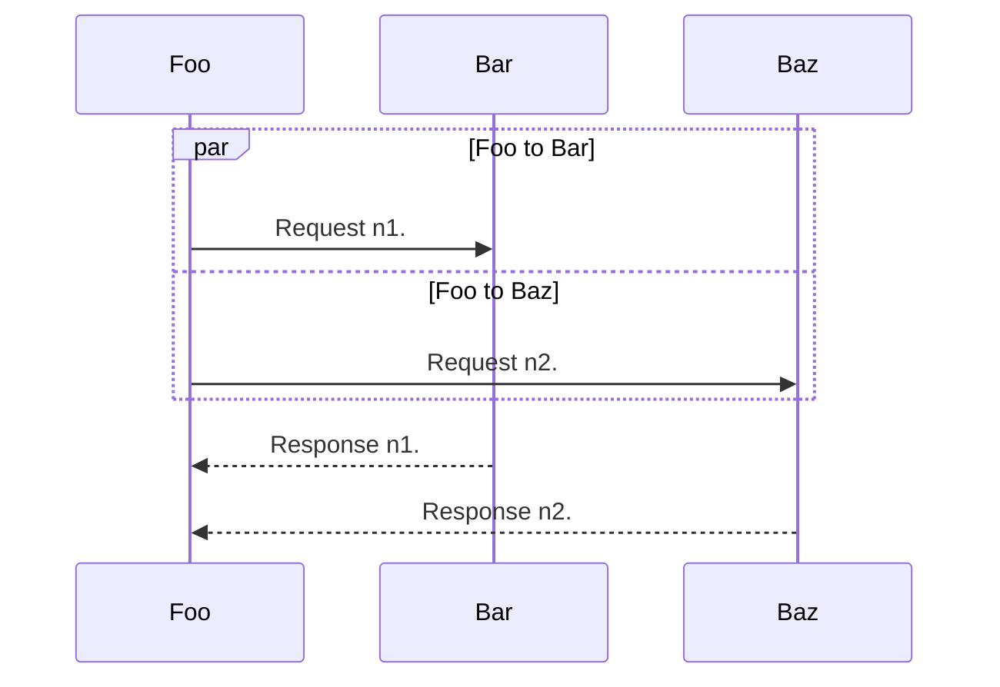

# Project

New project.

(describe-function \#'ispell-complete-word)

(describe-function \#'always) ; Do nothing and return t

(describe-function \#'ignore) ; Do nothing and return nil

Life as it goes prevented this project from happening. Until now.

Inspect the source of this readme file.

_italic_, **bold**, ***bold italic***, ___bold italic___

